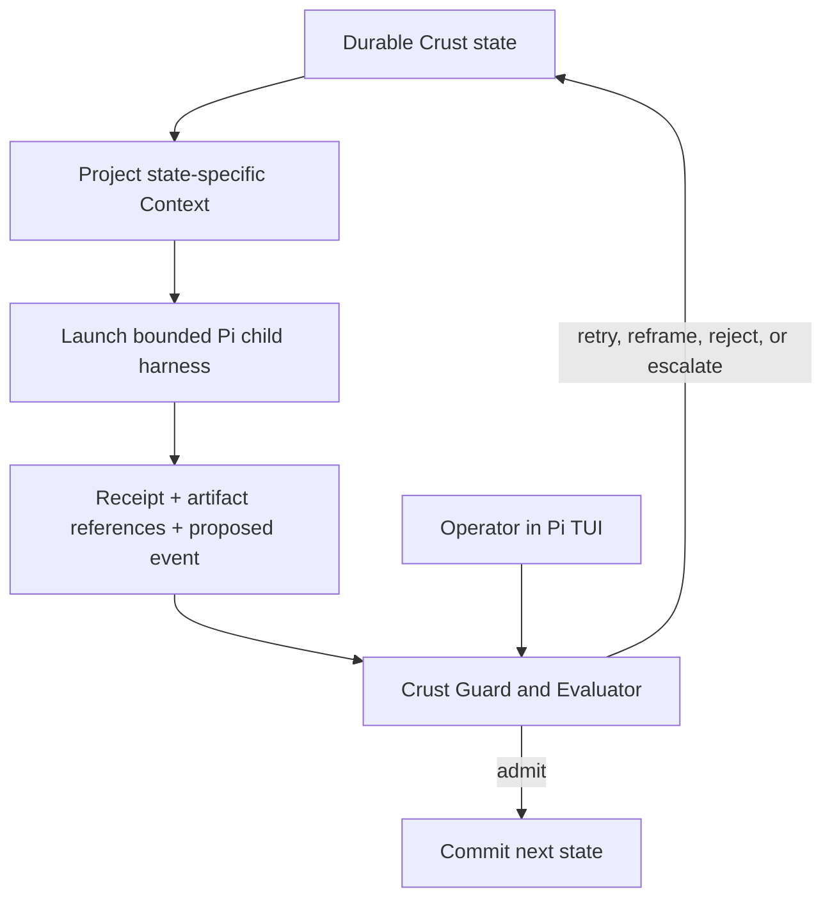

# Pi Crust

Pi Crust is a resumable, human-in-the-loop control plane for bounded Pi
harnesses.

```text
Pi TUI                 = operator console
Crust                  = workflow state machine and durable run store
child Pi harness       = bounded worker for one workflow state
composition lock       = pinned worker behavior for that state
Receipt + artifacts    = evidence used to advance the workflow
```

Pi is the execution substrate, not the workflow authority. Crust holds the
authoritative state and decides which transitions are legal. A child harness
may propose a transition; it cannot commit one.



## Core boundary

The parent does not give a child its entire history. It projects only the
Intent, relevant State, approved guidance, and capabilities needed for the
current state. The child can be interactive and may remain open through a
human conversation; it is still bounded by its state, capability set, and
terminal contract.

```text
authoritative State
  != model Context

durable continuity
  != one long model conversation
```

## Composition lock

Every state resolves a pinned composition before a child starts. A minimal lock
identifies:

```text
workflow revision
state name
skill and content version
system prompt and interaction policy
model
tools and capability bounds
Context projection rules
expected Receipt schema
terminal and transition guards
```

A resumed run uses its original workflow revision and composition locks. No
silent prompt, skill, model, or tool upgrade changes an in-flight run.

## Durable run state

The run store records only durable control-plane facts:

```text
run ID
workflow revision and state
composition and step locks
intent and state references
Receipts and artifact references
authority decisions and operator approvals
transition history
```

Child transcripts are optional referenced artifacts, not the parent control
interface. The parent steers from typed Receipts and artifacts, not hidden
prompt history.

## 7FH reading

| Factor | Crust responsibility |
| --- | --- |
| Terminality | Define terminal, blocked, retry, and escalation states. |
| State | Preserve authoritative run state separately from child Context. |
| Boundaries | Give each child an explicit, state-scoped capability set. |
| Control | Own legal transitions outside the child model. |
| Evaluation | Validate Receipts and obtain independent/operator verdicts. |
| Steering | Use Guard and Evaluation results to select the next state. |
| Receipts | Persist evidence binding a child result to the committed transition. |

## v0 limits

Crust v0 is intentionally not a generic workflow DSL, skill marketplace,
dynamic DAG engine, arbitrary multi-agent system, or autonomous supervisor.
It hard-codes one useful workflow and proves the boundary: state-machine
managed Context windows over Pi workers.

See [`eg/pocock`](./eg/pocock/) for the first workflow case.
