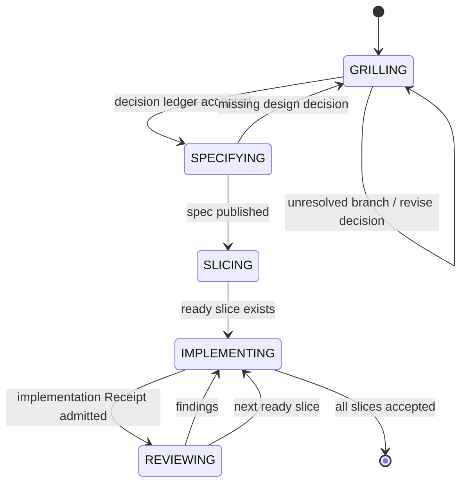

# Pocock workflow case

This case applies Pi Crust to one interpretation of Matt Pocock's engineering
workflow:

```text
setup once
  → grill-with-docs
  → to-spec
  → to-tickets
  → implement
      ├─ tdd
      └─ code-review
```

The POC does not claim that this is the only engineering workflow. It asks a
narrow systems question: can a durable state machine make this workflow
resumable, inspectable, and human-governed while using fresh Pi Context windows
for each phase?



## Roles

| Role | Responsibility |
| --- | --- |
| Crust | Stores state; pins each composition; projects Context; evaluates Receipts; owns transitions. |
| Outer Pi TUI | Shows state and evidence; obtains operator approvals; launches or resumes child work. |
| Child Pi harness | Performs one state-scoped task under a locked skill/model/tool composition. |
| Operator | Answers domain questions and approves consequential state changes. |

The outer session can remain long-lived for inspection and operator continuity.
Its model must not freely select workflow transitions. Each child is fresh for
its state, but may contain its own bounded interactive loop.

## Critical handoff: grilling to specification

`grill-me` resolves decisions conversationally. `to-spec` needs those decisions
without receiving an undifferentiated transcript. The durable handoff is a
decision ledger:

```text
decision ID
question and resolved answer
rationale and rejected alternatives
operator confirmation
glossary / ADR artifact references
composition lock and timestamp
```

The `GRILLING → SPECIFYING` transition is legal only when required decisions
are recorded and accepted. A transcript may be retained as an artifact, but it
is not the control contract.

## State-scoped compositions

Each Pocock phase resolves its own composition lock. For example:

```text
GRILLING
  skill: grill-me@version
  tools: proposeDecision, inspectDomainDocs
  terminal contract: accepted decision ledger

SPECIFYING
  skill: to-spec@version
  tools: publishSpec
  terminal contract: retrievable spec reference

IMPLEMENTING
  skill: implement@version
  tools: repository capability set
  terminal contract: implementation Receipt
```

The first executable slice is deliberately smaller: [`grill-me`](./grill-me/).
