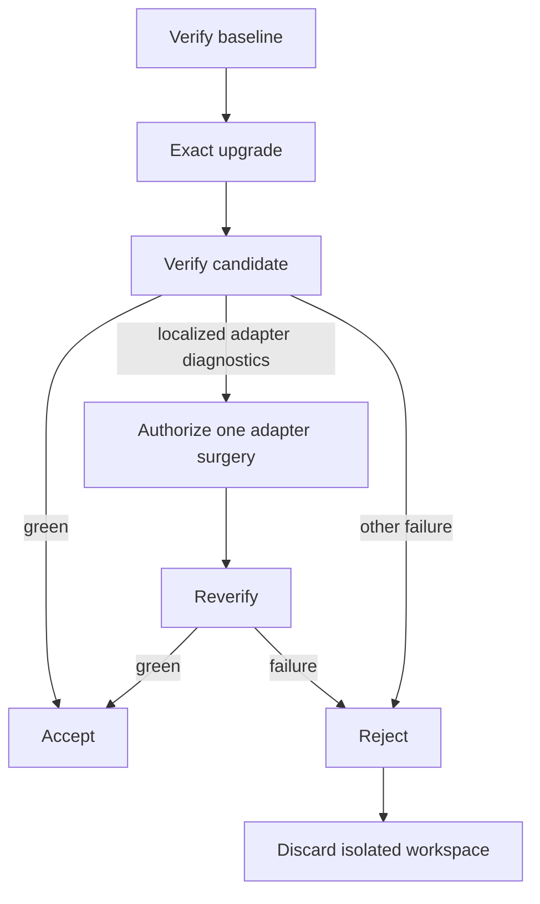

# Micro, Meso, and Macro Harnesses

> Status: operational layer model. This note concretizes the recursion proposed
> in [Goal Harness Scale Invariance](./scale-invariance.md). It does not add
> ontology terms.

Micro, meso, and macro describe where Intent, authority, Evaluation, steering,
and terminality are located. They do not describe repository size, model size,
agent count, runtime duration, or organizational importance.

The same harness questions recur at each layer. What changes is the unit being
steered, the evidence available to steer it, and the trust required to accept
its result.

## The layers

### Micro: one bounded transition

A micro harness governs one narrow State transition through one or a few
tightly related Capabilities.

```text
Intent
→ Proposal
→ Guard
→ Capability
→ Effect
→ Observation
→ Evaluator
→ terminate
→ Receipt
```

Its State is local enough to inspect directly. Its terminal predicate can
usually be evaluated after one attempted Effect. Its Reaction commonly stops
with success or failure.

Examples include a guarded file write, an authorized API call, or one isolated
code transformation with deterministic checks.

A micro harness is not merely a function call. It must separate Proposal,
authority, Effect, Observation, Evaluation, and evidence.

### Meso: evidence-driven composition

A meso harness governs progression across multiple bounded child Harness Runs
toward one workflow outcome.

```text
parent Intent
→ select child Intent
→ child Harness Run
→ child Receipt and artifacts
→ parent Observation
→ parent Evaluation
→ parent Reaction
→ next child / retry / reframe / stop / escalate
```

Its State includes workflow progress, child outcomes, and produced artifacts.
Its Capabilities include invoking bounded children. Its defining pressure is
steering: evidence from one child changes which transition is attempted next.

Running several micro harnesses in a fixed sequence is not enough. Without a
parent Intent, parent Evaluation, and evidence-driven Reaction, the result is a
script or pipeline rather than a demonstrated meso harness.

### Macro: durable production and promotion

A macro harness governs a durable value-production system composed from meso
harnesses. It owns promotion across consequential trust boundaries.

```text
request
→ specification
→ implementation workflow
→ validated candidate
→ promotion gate
→ released artifact
→ operational feedback
→ next bounded pursuit
```

Its State includes composition identity, artifact lineage, release status,
custody, operational evidence, and institutional memory. Its authority model
must distinguish creation, Evaluation, approval, and promotion. Its terminal
predicates include accepted, released, rolled back, superseded, and sustained
for a defined observation window.

A macro system may operate continuously, but it is composed of bounded Harness
Runs. “Always running” does not remove terminality; it moves terminality to
requests, releases, segments, and checkpoints.

## Comparison

| Property | Micro | Meso | Macro |
| --- | --- | --- | --- |
| Unit steered | one Effect | child Harness Runs | workflows, releases, and feedback cycles |
| Intent | local State condition | workflow outcome | durable value or production mandate |
| State | local resources | progress, Receipts, artifacts | lineage, releases, custody, operations |
| Capability | direct operation | invoke bounded child | compose, promote, roll back, deprecate |
| Evaluation | direct readback or check | judge child evidence and workflow progress | release, operational, and business fitness |
| Reaction | stop or fail | branch, retry, reframe, delegate, escalate | promote, roll back, supersede, reinvest |
| Evidence | transition Receipt | composed child evidence | promotion-grade lineage |
| Primary trust pressure | contain one Effect | trust child contracts | bind identity, authority, artifact, and release |

## Composition law

The critical seam is:

> A child Receipt and its referenced artifacts constitute parent Observation.

The parent should steer from this stable interface:

```text
child Intent
child composition identity
child verdict
child Receipt
referenced artifacts
```

The parent should not need the child's private prompt history, internal control
flow, or implementation details. If those internals are required to decide
whether the child succeeded, the child interface is too weak or its Receipt is
incomplete.

Composition does not erase authority. The parent must be authorized to invoke
the child, and the child independently authorizes its own Proposals. Likewise,
the parent Evaluator judges whether the child outcome advances the parent
Intent; it does not replace the child's Evaluator.

This creates nested, not flattened, control:

```text
parent Guard
  → child Harness Run
      → child Guard
      → child Effect
      → child Evaluator
      → child Receipt
  → parent Evaluator
  → parent Reaction
```

## Trust escalation

Harness topology may recur, but operational trust does not scale by repetition.

Micro trust can rely on local State, deterministic checks, and cheap reversal.
Meso trust needs stable child contracts, artifact identity, checkpointed
progress, and explicit failure propagation. Macro trust additionally needs:

- immutable composition releases
- exact run-to-release binding
- authenticated Principals
- separated creation, Evaluation, and promotion authority
- typed lineage edges
- artifact custody and provenance
- durable audit evidence
- replay, rollback, and supersession semantics

These are stronger implementations of recurring roles, not evidence that all
layers should share one universal harness implementation.

## Graduation tests

### Micro is demonstrated when

- one bounded Intent has an explicit terminal predicate;
- Proposals are authorized before Effect;
- Observation does not rely on Executor self-report;
- Evaluation determines success or failure; and
- the run emits a Receipt.

### Meso is demonstrated when

- each child transition preserves the control boundaries earned at the micro
  layer, without requiring reuse of a prior lab's implementation;
- the parent has its own Intent, State, Evaluation, Reaction, and Receipt;
- child evidence changes the parent's next transition;
- child failure cannot be silently rewritten as parent success; and
- the parent consumes a stable child interface rather than child internals.

### Macro is demonstrated when

- immutable composition identity binds every run;
- artifacts have durable lineage and custody;
- promotion is an authorized, evaluated transition;
- rollback or supersession is executable;
- production feedback enters a new bounded pursuit; and
- evidence can explain why an exact artifact was promoted.

## Current evidence

`hello-1` demonstrates micro evaluative control:

- Intent is distinct from Proposal.
- Effect is independently observed.
- Evaluator, not Executor, determines success.
- Reaction terminates and Receipt records evidence.

`hello-2-codeauth` strengthens the micro layer with contextual authority:

- Principal, Capability, and resource determine authority.
- Policy is snapshotted before execution.
- unmatched Proposals fail closed.
- denied Effects and preserved State are observable.

Both remain micro. Their Reaction terminates rather than selecting a meaningful
next child transition. They provide no parent Intent, child composition,
workflow checkpoint, durable lineage, or promotion boundary.

Meso therefore remains a hypothesis to test. The next example should compose
bounded micro-shaped transitions, consume child Receipts as parent evidence,
and choose a genuinely different next transition from Evaluation. It need not
import a prior lab: the dependence is typological, not implementation reuse. It
should add no macro machinery until that composition law works.

## Candidate meso experiment

> Status: agreed design hypothesis, not executable evidence.

Use a pinned `minimatch` `3.1.2` to `9.0.9` upgrade to break one pre-existing
dependency adapter. The parent should steer from child evidence:



The model-driven Executor participates only in remediation. It receives
compiler diagnostics, installed declarations, the adapter source, and the
remediation Intent. Its sole mutating Capability is one bounded whole-file
replacement of the adapter. Manifest, lockfile, tests, configuration, and
consumer code are protected after the deterministic upgrade transition.

The parent may authorize remediation only when the baseline passed, the exact
upgrade remained contained, every compiler diagnostic identifies the adapter,
the diagnostic context fits its budget, no install script was introduced, and
the one-attempt budget remains. Acceptance requires exact dependency identity,
green typecheck and behavioral tests, and an independently observed workspace
diff within the allowed mutation set.

The parent Receipt should bind ordered transitions, child Receipt identities
and verdicts, authority decisions, Reactions, terminal verdict, artifact
references, and Executor identity. Full compiler output, diffs, dependency
graph deltas, and optional model traces remain referenced artifacts.

Deterministic scenario chains should verify three control paths:

- valid adapter remediation is accepted;
- a protected-file Proposal is blocked and rejected; and
- an allowed but ineffective remediation fails reverification and is rejected.

These are conformance tests of harness structure. Cross-run evaluation of
model-backed traces may later tune a new harness version, but that learning
loop is outside this meso experiment.

The experiment deliberately defers version discovery, external research,
vulnerability and license Policy, AST analysis, arbitrary repository support,
general retry and planning, rollback of authoritative State, durable resume,
Git promotion, multi-agent execution, and production isolation.

## Relationship to 7FH

[The 7 Factor Harness](../7-factor-harness.md) supplies the review doctrine at
every layer:

```text
know done
preserve State
bound power
own control
judge independently
steer from judgment
leave useful evidence
```

Micro, meso, and macro identify where those responsibilities live. Scale
invariance proposes that their control roles recur. Executable examples must
earn the claim one layer at a time.
