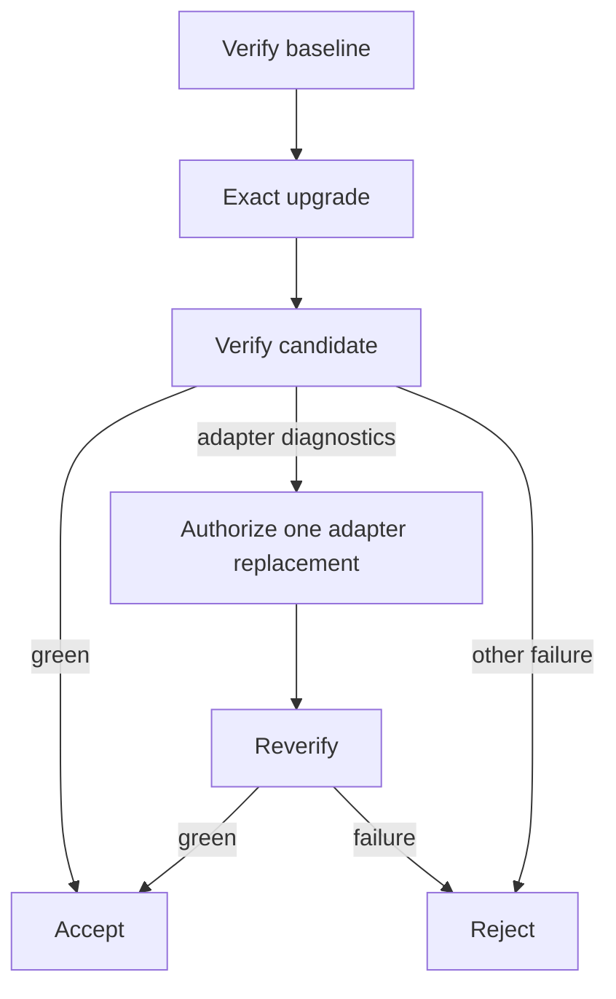

# Dependency Upgrade Meso Control

This chapter tests one claim: a parent can govern bounded workflow transitions
when transition evidence changes what happens next.

The fixture is a TypeScript file-selection service behind a stable dependency
adapter. It begins at `minimatch@3.1.2`. An exact upgrade to `9.0.9` breaks the
adapter's default import with `TS2613`; the consumer and behavior remain behind
the adapter seam.

## Layer map

```text
bun, filesystem, compiler       → mechanisms
Pi runtime                      → vanilla model harness
adapter-remediation composition → domain meta-harness
verify → upgrade → remediate    → workflow
parent phase/authority control  → meso Goal System
```

Verification and upgrade transitions emit Receipts without claiming that each
is independently a complete Goal System.

## Pressure

A version-bump script can install the package. One free-running Executor can
attempt the entire migration. Neither preserves who may mutate what, who judges
the result, or why remediation became authorized.

The parent instead composes three bounded transition interfaces:

```text
verify(workspace, label) → Verify Receipt
upgrade(workspace)       → Upgrade Receipt
remediate(context)       → Remediation Receipt
```

Each is a deep module: the parent learns one operation and one Receipt shape,
while process execution, dependency comparison, model interaction, guarding,
atomic replacement, and artifact capture remain local to their adapters.

## Evidence-driven control



The parent owns this phase machine. A failed candidate Verify Receipt becomes
parent Observation. Only diagnostics localized to the adapter, within the
Context budget, after a contained script-free upgrade, select remediation.
Other failures select rejection. This is steering, not reporting.

## Narrow authority

The model-driven Executor receives the remediation Intent, compiler
diagnostics, installed declarations, and adapter source. Its only mutating
Capability proposes one whole-file replacement.

The Guard requires:

- exactly one Proposal;
- the exact `src/minimatch-adapter.ts` path;
- a bounded UTF-8 byte count;
- an existing regular, non-symlink file; and
- atomic replacement.

The Executor cannot change manifests, lockfiles, tests, configuration,
fixtures, or consumer source. Installation is deterministic host work and
always uses `--ignore-scripts`.

## Independent acceptance

The producer's claim is insufficient. Verification independently runs
typecheck and behavioral tests. A terminal Observation rereads declared and
installed dependency identities and independently limits changed authoritative
files to manifest, lockfile, and adapter. Acceptance additionally requires
absence of new install scripts and the one-attempt budget.

Acceptance means only that this isolated candidate satisfies this run's
Intent. It does not commit, promote, merge, or establish production fitness.
Rejected workspaces are discarded.

## Receipts

Every transition Receipt has a content-derived identity independent of artifact
storage location. Artifact locations do not affect identity; artifact SHA-256
hashes do. The parent Receipt binds:

- fixture and Intent identity;
- ordered phases, Observations, and Reactions;
- transition Receipt identities and verdicts;
- remediation authority decision and Executor identity;
- independently observed final changed files;
- terminal declared and installed dependency identities;
- terminal verdict and reason; and
- Bun identity and artifact references.

Full compiler, test, install, dependency-delta, model-context, and Proposal
evidence remains in referenced artifacts. Each integration creates one
discoverable run root containing the parent Receipt and artifacts; rejecting a
candidate removes only its isolated candidate workspace.

## What the executable evidence earns

The deterministic scenarios establish:

1. localized failure selects one valid remediation, reverification, acceptance;
2. a protected-file Proposal is blocked and rejected;
3. an allowed but ineffective replacement is reverified and rejected; and
4. an independently observed protected mutation overrides a dishonest
   transition report.

Therefore a transition Receipt can serve as parent Observation and Reaction can
select a subsequent bounded transition. The example does not need to claim
that every transition is independently a complete Harness Run.

## Non-claims

This lab does not perform version discovery, release-note research,
vulnerability or license Policy, AST analysis, generalized planning/retry,
durable resume, rollback of authoritative State, Git promotion, cross-run
tuning, multi-agent execution, or production isolation. Dependency-count churn
is evidence for review, not a universal risk threshold.

- [Run the lab](./lab/README.md)
- [Canonical ontology](../hello-world/docs/ontology.md)
