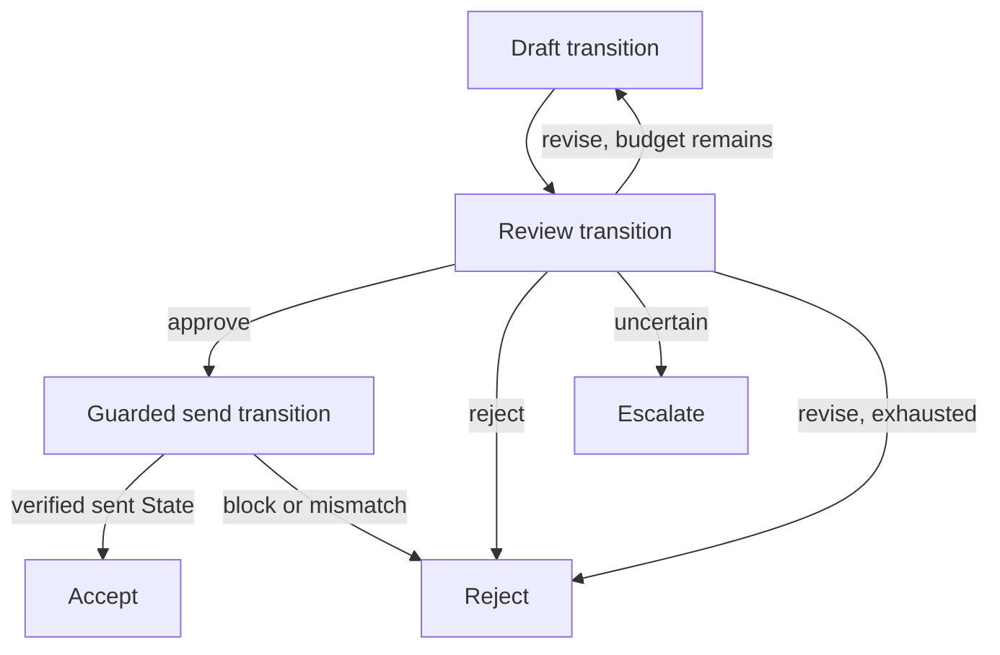

# Email Review-and-Send Meso Goal System

This example begins with a correction: draft-only email is primarily an MCP
design problem, not a harness.

A trusted server may hold a broad provider credential while exposing only:

```text
readThread(threadId)
createReplyDraft(threadId, body)
readDraft(draftId)
```

Recipients and reply subject are derived server-side. The draft interface has
no send operation. Provider read-after-write verifies that the result is an
unsent draft. This is a deep mechanism module, not yet a Harness Run.

## Pressure that earns the Goal System

Control becomes Goal-System-shaped when a reviewed draft may progress into the
consequential act of sending:



This is meso because a Review Receipt becomes parent Observation and
selects a genuinely different next bounded transition.

## Transition contracts

The parent composes three bounded transition interfaces:

```text
draft(thread, optional feedback) → Draft Receipt
review(thread, exact draft)      → Review Receipt
send(approved exact draft)       → Send Receipt
```

## Layer map

```text
mock provider and MCP interfaces → mechanisms
OpenRouter completion client     → vanilla model harness
drafter/reviewer compositions    → domain meta-harnesses
draft → review → send            → workflow
parent authority and branching   → meso Goal System
```

The draft transition projects only the selected thread into Executor Context.
The review transition binds its verdict to the observed draft hash. The send
transition
rereads the draft and allows Effect only when:

- the Review Receipt says `approve`;
- immutable, pre-review Policy trusts the requested reviewer composition;
- the Review Receipt binds the exact versioned criteria Policy; and
- the current draft hash equals the reviewed draft hash.

Authority covers one exact reviewed artifact, not “permission to send email.”

## Parent control

The parent owns one revision budget and terminality:

- `approve` selects guarded send;
- `revise` selects one redraft with review feedback;
- a second revision request rejects;
- `reject` terminates without send;
- `escalate` terminates for human input;
- blocked or unverifiable send rejects.

An LLM judge may review the draft, but it does not implicitly own authority.
The integration's explicit mock Policy trusts its configured reviewer identity.
Requested composition identity remains the authority input; actual routed
response-model identity is recorded separately as evidence and cannot expand
Policy.
No model verdict in this example can authorize a live email Effect.

## Independent verification

The MCP mechanism performs local read-after-write verification. Bounded
transitions then independently reread draft and sent objects. Finally, the
parent observes the mock mailbox snapshot and mutation log.

Acceptance requires:

- exactly one new sent message;
- sent content matching the exact approved draft;
- unchanged unrelated messages;
- unchanged pre-existing drafts; and
- only draft-create and draft-send mutations.

Tests demonstrate rejection when a draft changes after review, a provider
returns mismatched sent State, an untrusted reviewer approves, or a send adapter
secretly archives an unrelated message.

## Sensitive evidence

Executors necessarily receive selected email content. Receipts retain hashes,
identities, verdicts, transitions, and mutation operation names—not source
bodies, draft bodies, feedback text, or recipient addresses.

```text
Executor Context ≠ durable Receipt content
```

## Evidence

Deterministic conformance covers the narrow MCP contract and eleven parent
control paths. The optional integration uses OpenRouter for both drafting and
review against the mock provider. It requires an explicit external-model flag
and has no live mailbox capability.

This earns no new noun. It strengthens existing relationships:

- a transition Receipt may serve as parent Observation;
- Reaction may select another bounded transition;
- workflow coordination and outcome governance remain distinct.

## Scope

Deferred: live provider integration, real sending, inbox discovery, autonomous
selection, attachments, durable resume, recurring intake, organizational
policy, RAG, cross-run learning, and macro operation. RAG and integration count
do not determine scale; durable recurring production would create macro
pressure.

- [Run the lab](./lab/README.md)
- [MCP versus harness thinking](./mcp-notes.md)
- [Canonical ontology](../hello-world/docs/ontology.md)
