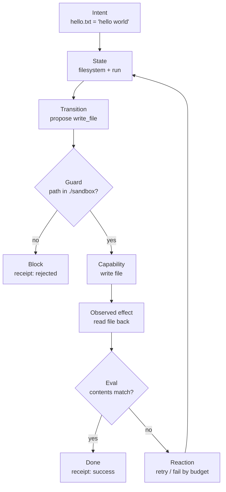

The sensible canonical hello world is:

```txt
“Change one file to a desired value, but only through a guarded/evaluated harness.”
```

Not light switch. Not agent writes code. Not full software factory.

Why this one works:

```txt
It has real state.
It has a real capability.
It has an admissibility constraint.
It has an observable effect.
It has out-of-band eval.
It has reaction.
It can leave a receipt.
```

Canonical hello world:

```txt
Intent:
  ./sandbox/hello.txt contains "hello world"

State:
  filesystem + current run state

Capability:
  write_file(path, content)

Constraint:
  may only write inside ./sandbox

Transition:
  propose write_file("./sandbox/hello.txt", "hello world")

Effect:
  file contents change

Eval:
  guard: path is allowed
  checker: read file back
  judge: contents exactly equal expected value

Reaction:
  allow write
  retry if readback mismatch
  block if path outside sandbox
  stop on success

Authority:
  guard has authority to block
  checker has authority to request retry
  judge has authority to terminate

Receipt:
  proposal, guard verdict, write result, readback, final verdict
```

Mermaid:



The tiny implementation-shaped contract:

```ts
type HelloWorldHarness = {
  intent: { path: "./sandbox/hello.txt"; contents: "hello world" };
  constraint: { writableRoot: "./sandbox" };
  transition: "write_file";
  guard: "path_must_be_inside_writable_root";
  checker: "readback_equals_expected";
  reaction: "block | retry | terminate";
  receipt: "append_ledger_event";
};
```

This is minimal but not toy. It distinguishes:

```txt
fs.writeFile = execution
guard → write → readback → judge → react → receipt = harnessing
```

That is probably the canonical “hello world” for goal-harness engineering.
