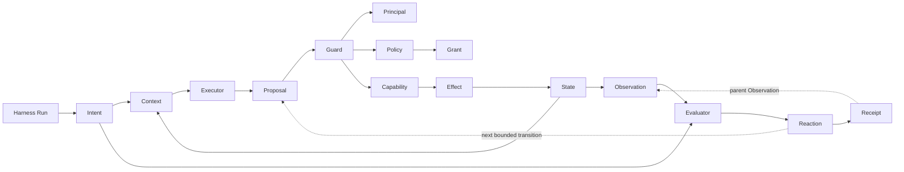

# Harness Engineering Ontology

Canonical terms earned by the examples. This file records the model; the
chapter README derives it.

> Terminology note: [Goal-System Engineering](../../goal-system-engineering/README.md)
> proposes a future migration from broad “Harness Run” usage to “Goal System
> Run.” This ontology preserves current canonical names until that migration is
> accepted.

## Current terms

**Harness Run**  
One bounded pursuit of an Intent.

**Intent**  
A desired condition of State.

**State**  
The world a Harness Run may affect and observe.

**Context**

The selected view of State, history, and guidance presented to one Executor.
Context may intentionally omit sensitive or unauthorized State.

**Executor**  
A model-driven runtime that interprets Intent and emits Proposals.

**Proposal**  
A requested Capability invocation. It has no effect until authorized.

**Guard**  
A pre-effect authority decision that allows or blocks a Proposal.

**Capability**  
An available operation that may change State.

**Effect**  
A State change caused by an authorized Capability invocation.

**Observation**  
Evidence about State obtained independently of the Executor's claim.

**Evaluator**  
A post-effect judgment comparing Observation with Intent.

**Reaction**  
The harness response to a Guard or Evaluator verdict. It may terminate a
Harness Run or select the next bounded transition.

**Receipt**  
Structured evidence of the Proposal, authority decision, Effect, Observation,
and final verdict.

**Principal**

The actor whose authority is evaluated for a Proposal.

**Grant**

Permission for one Principal to use one Capability on one State resource.

**Policy**

The immutable set of Grants consulted during a Harness Run.

No new noun is required for meso workflow governance. A bounded transition's
Receipt may serve as parent Observation. Only call that transition a child
Harness Run when it independently satisfies the full Run anatomy.

## Relationships

Implementation names such as Pi, OpenRouter, tool hook, filesystem, and JSON
stdout are not ontology.
