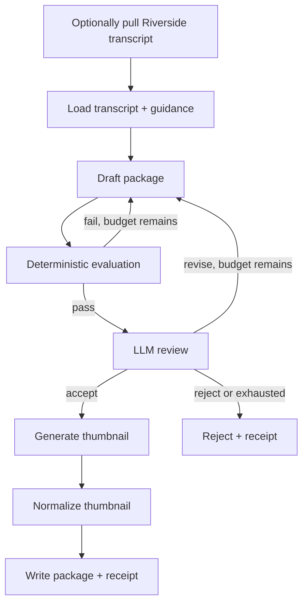

# Podcast Producer: Harness-Oriented Workflow Governance

This is a read-only case-study of `poducer-agent`, a podcast-to-YouTube
packaging workflow. It takes a transcript and produces title candidates,
description, chapters, tags, thumbnail direction, and a test matrix.

It serves this textbook as a realistic contrast to the small executable
examples: the product is useful, model-facing, and has a revision loop. It is
not a Harness Run or Goal System; its control features are workflow governance.

## What it demonstrates



The parent, not either model call, owns the state machine, two-revision budget,
and terminal verdict. Deterministic schema and platform checks precede review;
review feedback changes the next draft Context. Accepted packaging selects image
generation, then deterministic 1920×1080 PNG normalization below 2 MiB, before
the workflow writes its artifacts. The optional Riverside step acquires source
material and provenance before the package workflow starts. Each run records
input hashes, prompt hashes, phase history, model identities, evaluations,
reviews, artifacts, and a terminal verdict.

This shows a useful governance pattern:

```text
draft artifact + evaluation/review result = parent Observation
Observation changes next transition      = parent Reaction
```

It also shows that a reviewer is not merely commentary when its `revise`,
`reject`, and `accept` verdicts control the parent's next state.

## Layer map

```text
Bun, filesystem, Pi, Codex/OpenRouter   -> mechanisms
Riverside transcript retrieval           -> source-acquisition mechanism
structured package/review tool calls     -> bounded producer interfaces
draft, evaluate, review, image, optimize -> workflow transitions
retry budget and terminal branching      -> workflow governance
```

The provider, model, and Pi runtime are implementation choices, not ontology.
The relevant roles are Executor, Context, Proposal-like package/review output,
Evaluation, Reaction, and Receipt.

## Classification

The workflow is not a harness. It does not pursue an authoritative State
condition through bounded Proposals, Guards, Effects, independent Observation,
and Evaluation. Nor is it a Goal System: it has no parent Intent over protected
State, authority model, or consequential capability to govern.

It does have harness-oriented workflow governance:

- Its LLM reviewer is a separate producer role, not an authoritative external
  Observation of YouTube state or audience outcome.
- Acceptance authorizes only local artifact writing; it does not guard a live
  publish, title change, thumbnail upload, or other consequential Effect.
- Image generation proves only that an image exists, and optimization proves
  its delivery dimensions and byte budget. Neither independently judges the
  actual image against the approved thumbnail direction.
- Riverside retrieval authenticates and records source provenance, but does not
  independently establish transcript correctness or govern an upstream edit.
- The transcript and style files are Context, but the system does not model a
  protected authoritative State, Principal, Grants, or Policy.
- Receipts have valuable hashes and run history, but no immutable composition
  identity, durable resume, promotion authority, or rollback.
- No focused conformance suite establishes the control paths.

Thus it is more than a linear pipeline: judgment steers a bounded parent loop.
Calling its final file write "publication" would collapse artifact production
into an external Effect.

## How it informs the textbook

The case study creates the next concrete pressure after the existing
dependency-upgrade and email examples: a content package becomes consequential
only when a reviewed, exact package may be promoted to a real platform.

An executable follow-on would need bounded transitions such as:

```text
package(transcript, guidance)       -> Package Receipt
review(exact package, criteria)     -> Review Receipt
publish(exact approved package)     -> Publish Receipt
observe(video id and platform state)-> Observation
```

The publish Guard should bind one exact reviewed artifact hash, an explicit
Principal and Policy, a trusted reviewer/composition identity, and the target
video resource. The parent would independently reread platform state and
accept only if the observed publication matches the approved package. Revision,
rejection, or mismatch would select a different Reaction.

That would test the textbook's distinction between workflow governance and a
Goal System authorized to cause an external Effect—without claiming macro
operation until durable promotion, custody, rollback, and recurring production
pressures exist.

## Non-claims

This document does not copy, execute, or certify the producer implementation.
It does not claim factual accuracy of generated packaging, publish authority,
YouTube integration, audience optimization, or macro-scale operation.
