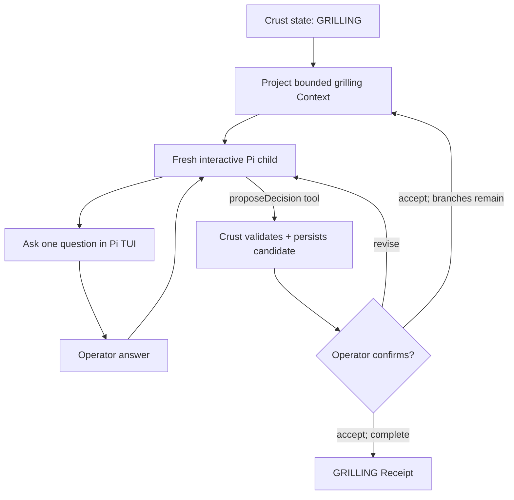

# `grill-me` as one Crust state

This is the minimum Pi Crust delivery for a single interactive `GRILLING`
state. It does not implement the whole Pocock workflow. It proves that an
interactive skill can be a locked, state-scoped composition whose decisions are
recorded through Crust rather than inferred from a transcript.

## Run it

The POC uses Pi's normal `InteractiveMode`, session management, tool display,
and OpenAI Codex OAuth storage. Crust enters as one inline Pi extension; it
does not replace the TUI or Pi's agent loop. The child disables ambient Pi
skills, prompt templates, and extensions so its locked composition remains the
one governing behavior.

```bash
npx @earendil-works/pi-coding-agent
# In Pi: /login → OpenAI Codex

npm run crust:grill-me -- \
  --idea "Design a durable agent workflow" \
  --question "authority:Who advances workflow state?"
```

The command requires ChatGPT Plus or Pro OAuth configured for Pi's
`openai-codex/gpt-5.5` model at Pi's `medium` thinking level. It persists the run under `.crust/runs/` by
default; use `--resume <run-id>` to reopen the same authoritative state.

Inside the normal Pi TUI, the model may use `propose_decision`. The operator
retains authority through:

```text
/crust status
/crust approve <decision-id>
/crust reject <decision-id> <reason>
/crust complete
```

`propose_decision` writes a candidate but cannot accept it or complete the
state. `/crust approve` opens Pi's standard confirmation prompt before the
decision ledger is changed.

## Intent and terminality

**Intent:** resolve the material design branches of one stated idea with a
human operator.

**Success:** every required question has an operator-confirmed decision and a
durable decision ledger exists.

**Other terminal outcomes:** operator cancels; an unresolved empirical question
is escalated to research/prototype; or the run is blocked because required
input is unavailable.

## Minimal shape



The child owns the local interview loop. Crust owns the authoritative decision
record and determines whether the state may finish.

## Locked composition

```text
state: GRILLING
skill: grill-me@<content-hash>
model: <pinned model identifier>
system policy: ask one question; recommend an answer; do not implement
Context projection: idea + open decisions + accepted ledger + relevant domain docs
capabilities: inspectDomainDocs, proposeDecision
expected Receipt: grilling-receipt/v1
```

`grill-me` is therefore an aspect of the pluggable composition, not ambient
agent lore. Its behavior is reproducible for the run that used it.

## State-machine tool boundary

The child must not announce that a decision is resolved only in prose. Crust
provides the proposal tool:

```ts
proposeDecision({
  questionId,
  decision,
  rationale,
  alternativesRejected,
  glossaryChanges,
  adrDraft,
})
```

Calling it creates `DECISION_PROPOSED`; it does not advance the workflow.
Crust validates the current state, schema, question identity, and allowed
artifact references. The Pi TUI then presents the candidate for confirmation.
Only confirmation creates `DECISION_ACCEPTED` and updates the ledger.

## Minimal authoritative state

```text
run ID and workflow revision
state: GRILLING
locked grill-me composition
idea reference
required / open / accepted question IDs
accepted decision ledger
operator approvals
artifact references: CONTEXT.md and ADR deltas, optional transcript
```

The projected child Context is derived from this state. It is disposable; the
state and accepted decisions are not.

## Receipt

`grilling-receipt/v1` binds:

```text
run and composition identities
projected Context identity
questions asked and their final status
accepted decision IDs
operator approvals
glossary / ADR artifact references
terminal verdict: complete | blocked | cancelled | escalated
proposed next event when complete
```

## 7FH review

| Factor | Minimum POC evidence |
| --- | --- |
| Terminality | Explicit complete, blocked, cancelled, and escalated outcomes. |
| State | Decision ledger is authoritative; child Context is a projection. |
| Boundaries | Child may inspect domain material and propose, never self-accept. |
| Control | Crust owns question/decision status and state completion. |
| Evaluation | Schema checks plus operator confirmation judge each candidate. |
| Steering | Confirmation returns to another question or emits completion. |
| Receipts | A typed grilling Receipt binds decisions, evidence, and terminality. |

## Non-goals

No generic questionnaire engine, autonomous completion inference, transcript
mining, specification generation, ticketing, implementation, or dynamic
workflow composition. The POC is one interactive child harness whose durable
output is an accepted decision ledger.
