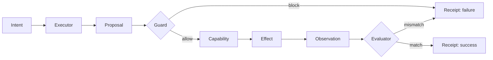

# Harness Engineering: Hello World

The smallest useful harness asks an executor to make one real change:

> Ensure `./sandbox/hello.txt` contains exactly `hello world`.

A function could write the file directly. That would demonstrate execution, not
harness engineering. The point is to expose the boundaries around execution.

## 1. Intent produces a proposal

The executor receives the intent and a `write_file(path, content)` capability.
It emits a tool call.

That call is a **Proposal**, not yet an effect. The executor requests action; it
does not grant itself authority.

```text
Intent → Executor → Proposal
```

## 2. A proposal requires authority

A **Guard** inspects the Proposal before execution. It allows only the exact
target path.

```text
Proposal → Guard → block | allow
```

Without this boundary, a tool call is immediately authoritative.

## 3. An allowed action produces an effect

When allowed, the `write_file` **Capability** runs and changes filesystem
**State**.

```text
allow → Capability → Effect
```

The tool reporting success is not proof that the intent is satisfied.

## 4. Effect must be observed and evaluated

The harness reads the file back. This **Observation** is compared with the
Intent by an **Evaluator**.

```text
Effect → Observation → Evaluator → success | failure
```

This separates execution from goal satisfaction.

## 5. A verdict needs evidence

The host terminates the run and emits a **Receipt** containing the Proposal,
Guard decision, tool result, readback, and final verdict.

```text
verdict → Reaction → Receipt
```

The executor does not declare its own success.

## Resulting flow



The irreducible distinctions are:

```text
intent ≠ proposal
proposal ≠ authorization
authorization ≠ effect
effect ≠ observation
observation ≠ success
success ≠ evidence
```

Remove the executor and this becomes a script. Remove the Guard and it becomes
raw tool execution. Remove readback and the harness trusts self-report. Remove
the Evaluator and no component judges the goal. Remove the Receipt and the
result is not accountable.

## 6. Authority is contextual

The first lab's Guard knows one path. A reusable Capability needs a stronger
answer: who may perform which operation on which State resource?

```text
authority = Principal × Capability × State resource
```

`hello-2-codeauth` snapshots the actor and rules before execution. Every
Proposal is normalized, checked against unconditional hard denials, then
matched exactly against the actor's allowed operation and resource. Missing or
unknown identity, symlink traversal, and absent matches fail closed.

The actor is the **Principal**. One permitted Principal–Capability–resource
tuple is a **Grant**. The immutable set of Grants consulted during a Harness
Run is its **Policy**.

The Receipt identifies the Principal, normalized resource, matched Grant or
denial reason, and Effect. It does not reproduce the full Policy.

## Scope

This chapter deliberately excludes retries, durable history, orchestration,
multiple capabilities, ambiguous intent, and adversarial path hardening. Those
concerns should be introduced only when a later example requires them.

`hello-2-codeauth` also freezes its own limits: UTF-8 text rather than arbitrary
bytes, preflight rather than race-safe symlink defense, trusted canonical Policy
resources, Git email as a label rather than authentication, final rather than
per-Proposal write Observation, and model-dependent integration behavior.
These are explicit non-claims, not properties of contextual authority.

- [Run the lab](./examples/hello-1/README.md)
- [Run the contextual authority lab](./examples/hello-2-codeauth/README.md)
- [Current ontology](./docs/ontology.md)
- [Design notes](./docs/hello-world.md)
- [Optimization notes](./docs/hello-world-optimization.md)
