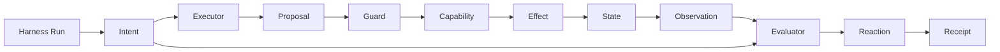

# Harness Engineering Ontology

Canonical terms earned by the examples. This file records the model; the
chapter README derives it.

## Current terms

**Harness Run**  
One bounded pursuit of an Intent.

**Intent**  
A desired condition of State.

**State**  
The world a Harness Run may affect and observe.

**Executor**  
A model-driven runtime that interprets Intent and emits Proposals.

**Proposal**  
A requested Capability invocation. It has no effect until authorized.

**Guard**  
A pre-effect authority decision that allows or blocks a Proposal.

**Capability**  
An available operation that may change State.

**Effect**  
A State change caused by an authorized Capability invocation.

**Observation**  
Evidence about State obtained independently of the Executor's claim.

**Evaluator**  
A post-effect judgment comparing Observation with Intent.

**Reaction**  
The harness response to a Guard or Evaluator verdict. In `hello-1`, it only
terminates.

**Receipt**  
Structured evidence of the Proposal, authority decision, Effect, Observation,
and final verdict.

## Relationships

Implementation names such as Pi, OpenRouter, tool hook, filesystem, and JSON
stdout are not ontology.
